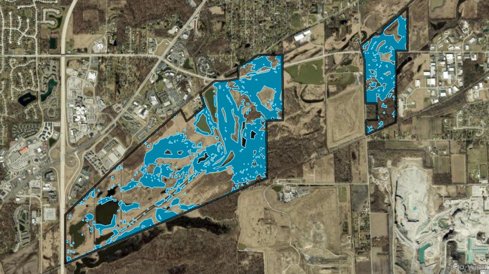
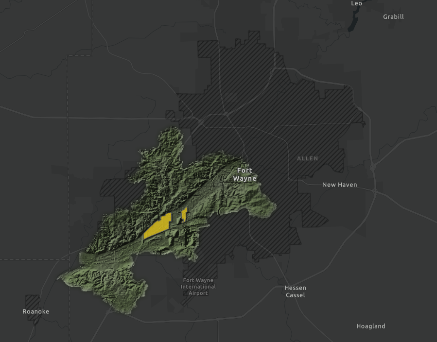
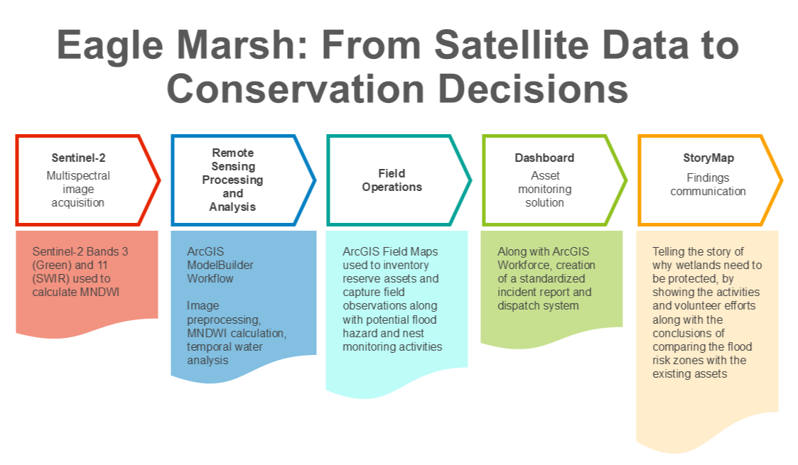
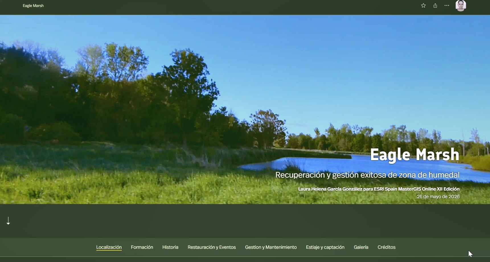
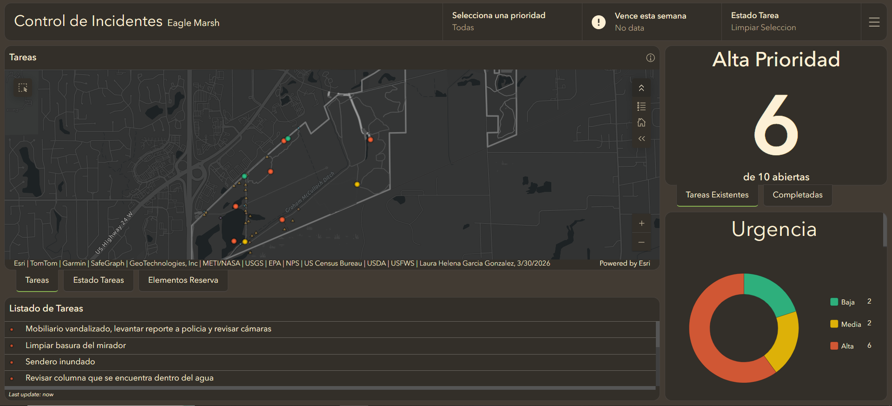
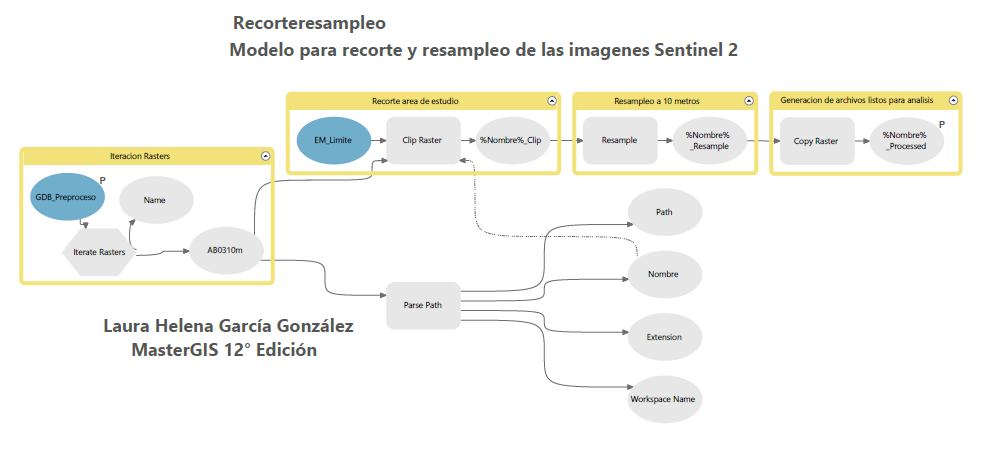
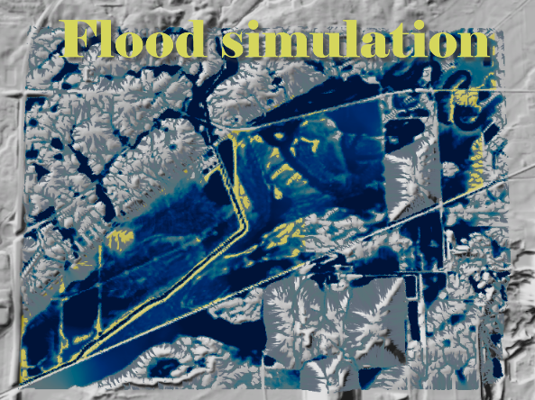

# 🌿 Eagle Marsh Wetland Monitoring System



## 🗺️ Remote Sensing & GIS Workflow for Wetland Moisture Analysis

## Project Overview

Wetland ecosystems require continuous monitoring to understand seasonal changes in water availability, habitat conditions, and environmental patterns.

This project developed a GIS-based monitoring workflow to evaluate moisture variation within **Eagle Marsh**, an approximately **800-acre wetland ecosystem**, using satellite imagery, raster analysis, and automated geoprocessing tools.



The goal was to create a repeatable spatial workflow that supports environmental analysis and helps communicate changing landscape conditions to conservation and management stakeholders.

---

## 🎯 Objectives

The project focused on:

* Analyzing seasonal moisture changes within Eagle Marsh
* Applying remote sensing techniques to identify surface water and vegetation moisture patterns
* Developing repeatable GIS workflows for raster processing
* Creating visual outputs that communicate spatial trends for decision-making

---

## 🛰️ Data Sources

The workflow incorporated:

* **Sentinel-2 satellite imagery**

  * Multispectral imagery
  * 10-meter spatial resolution
  * Used for vegetation and water-related indices

* **Digital Elevation Model (DEM) data**

  * Terrain analysis and environmental context

* **Hydrologic and watershed datasets**

  * Spatial context for wetland analysis

---
## Project Workflow



## ⚙️ Methodology

The workflow was developed using ArcGIS Pro and included:

### Remote Sensing Analysis

Calculated spectral indices including:

* **Normalized Difference Water Index (NDWI)**
* **Modified Normalized Difference Water Index (MNDWI)**

These indices were used to evaluate moisture and surface water patterns across different time periods.


### GIS Processing Workflow

The project incorporated:

* Raster preprocessing
* Spatial clipping and resampling
* Raster calculations
* Classification and remapping
* Focal statistics
* Geodatabase organization

### Workflow Automation

ArcGIS Pro ModelBuilder was used to create repeatable geoprocessing workflows, reducing manual processing steps and improving consistency.

---

## 🛠️ Technologies Used

### GIS

* ArcGIS Pro
* ArcGIS Online
* ArcGIS StoryMaps
* ArcGIS Dashboards
* ModelBuilder

### Remote Sensing

* Sentinel-2 imagery
* Raster analysis
* Spectral indices

### Data & Programming

* Python (future workflow automation)
* Spatial data management
* Geoprocessing concepts

---

## 📊 Project Outputs

The project produced:

🌎 **Interactive StoryMap**

* Communicates project background, methodology, and findings



📈 **Dashboard**

* Provides visual summaries of spatial analysis results



⚙️ **ModelBuilder Workflows**

* Documents repeatable GIS processing steps



🎥 **Project Visualization**

* Time-based visualization of landscape changes



---

## 📁 Repository Structure

```
eagle-marsh-wetland-monitoring/

├── README.md
│
├── images/
│   ├── maps/
│   └── screenshots/
│
├── docs/
│   └── Framework.md
        Model Workflow.md
|
│
├── models/
│   └── modelbuilder-workflows/
│
└── scripts/
    └── future-automation/
```

---

## 🌱 Key Skills Demonstrated

This project demonstrates experience with:

* Spatial analysis
* Remote sensing workflows
* Raster processing
* GIS automation concepts
* Environmental GIS applications
* Communicating spatial information through web-based tools

---

## 🚀 Future Improvements

Planned enhancements include:

* Python automation of raster processing workflows
* Integration with ArcGIS APIs
* Expanded temporal analysis
* Additional web GIS visualization tools

---

## 👩‍💻 About

Created by **Laura Garcia**

GIS Professional specializing in spatial analysis, automation, and Web GIS solutions.

Maps are more than visualizations — they are tools for understanding problems, communicating patterns, and supporting better decisions.
