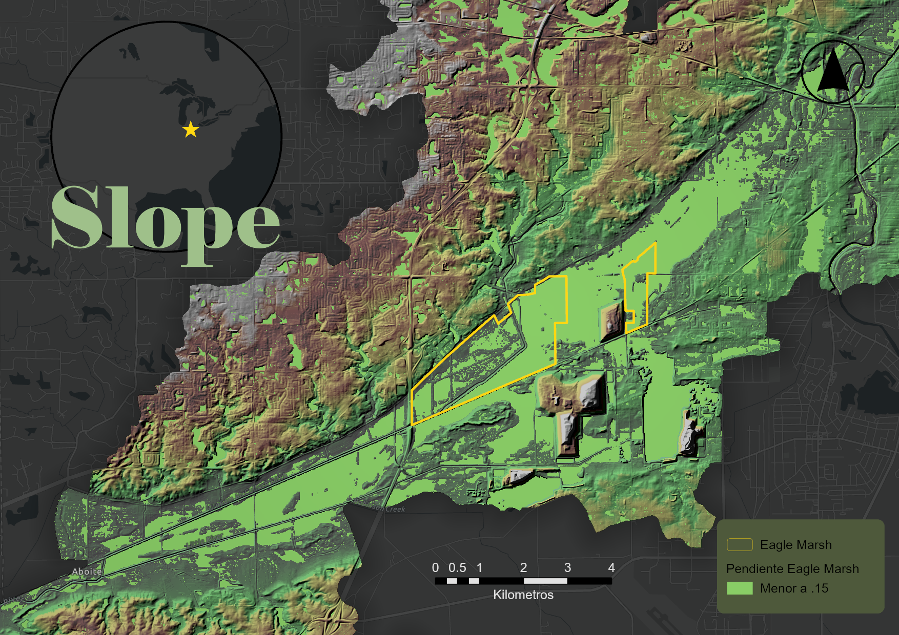

# Datasets Sources and Preparation

## Dataset Summary

| Dataset | Source | Purpose |
|---|---|---|
| Sentinel-2 Multispectral Imagery | Copernicus Data Space Ecosystem | NDWI and MNDWI calculations for evaluating wetland moisture and surface water changes |
| Indiana Digital Elevation Model (DEM) | IndianaMap.org | Terrain characterization and slope analysis |
| HUC 12 Watershed Boundaries | IndianaMap.org | Hydrologic context for the Eagle Marsh study area |
| LiDAR Dataset - Fort Wayne West | IndianaMap.org | 3D terrain visualization and precipitation flow simulation |

## Sentinel-2

Source: Copernicus Data Space Ecosystem  
https://browser.dataspace.copernicus.eu/

Sentinel-2 imagery was downloaded in May 2026 for two representative seasonal conditions:

- **03/02/2026:** Precipitation-deficit condition used as the dry reference period.
- **04/21/2026:** Post-precipitation condition used as the wetter reference period.

The analysis used Sentinel-2 spectral bands at 10 m and 20 m resolution resampled to a common 10 m grid.

- **NDWI:** Green (Band 3) and Near Infrared (Band 8)
- **MNDWI:** Green (Band 3) and Short-Wave Infrared (Band 11)

These indices were used to evaluate changes in surface water and wetland moisture conditions.

## Indiana DEM Tile Footprints 

Source: IndianaMap.org

DEM tiles were used to derive terrain characteristics, including slope, and to support the interpretation of wetland hydrologic conditions.

## Watersheds

Source: IndianaMap.org

The HUC 12 watershed feature layer was used to provide hydrologic context for the Eagle Marsh study area.

## LiDAR Dataset - Fort Wayne West

Source: IndianaMap.org

LiDAR data was used to generate a detailed terrain surface for 3D visualization and precipitation flow simulation within ArcGIS Pro.

