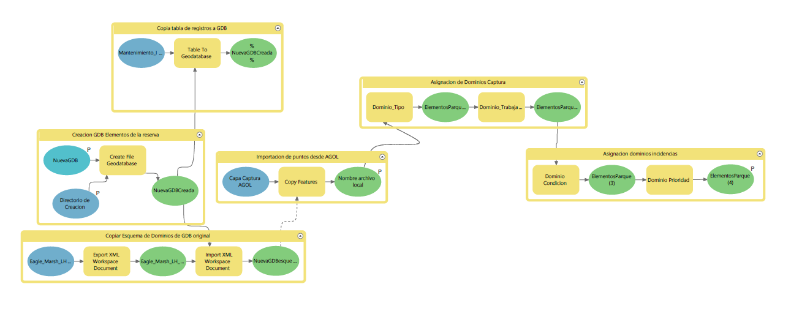
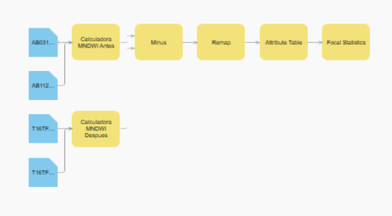

# GIS Solution Components

The completed framework produces a series of complementary GIS products:

## ArcGIS Pro project

## Automated ModelBuilder workflows
  
  
## Custom raster function for temporal moisture comparison

  
## Moisture gain and loss analysis

## Terrain and slope analysis

  
## Enterprise geodatabase for asset management

## ArcGIS Dashboard

## ArcGIS StoryMap

## Workforce project

## Field Maps project

## Technical documentation and GitHub repository
