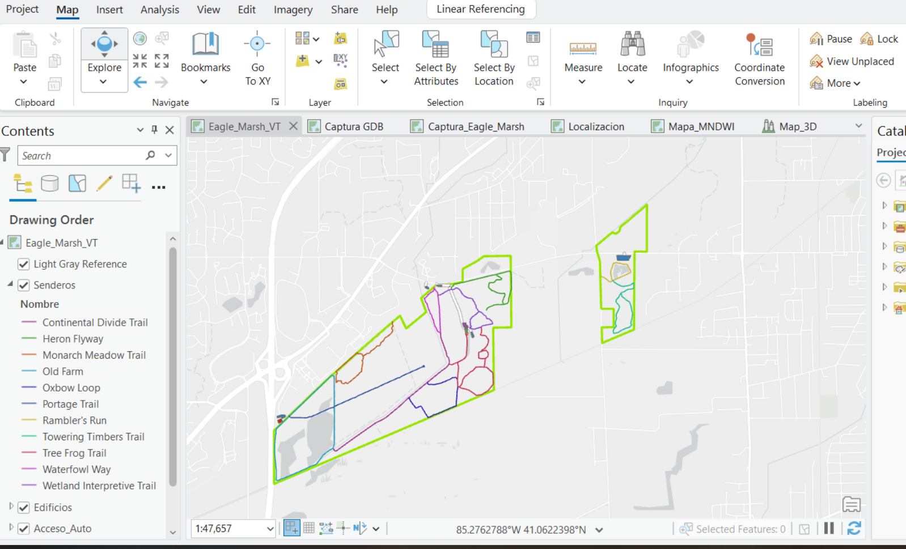
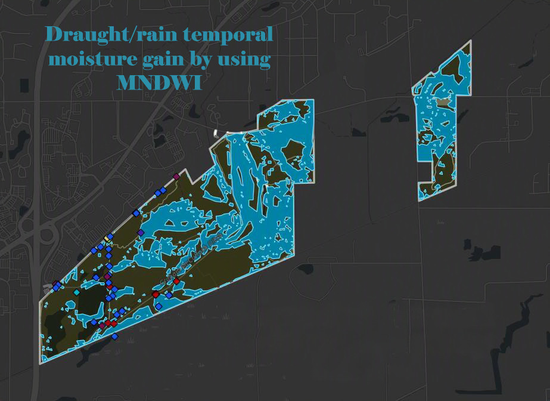
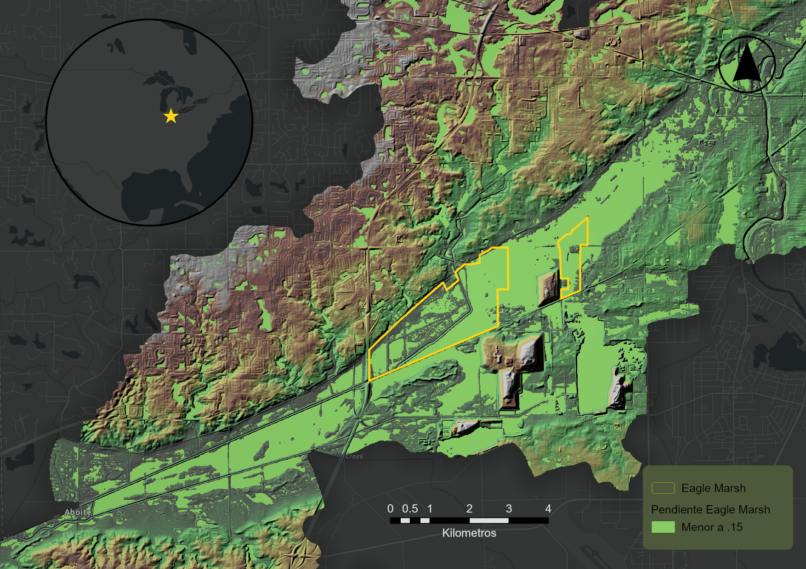
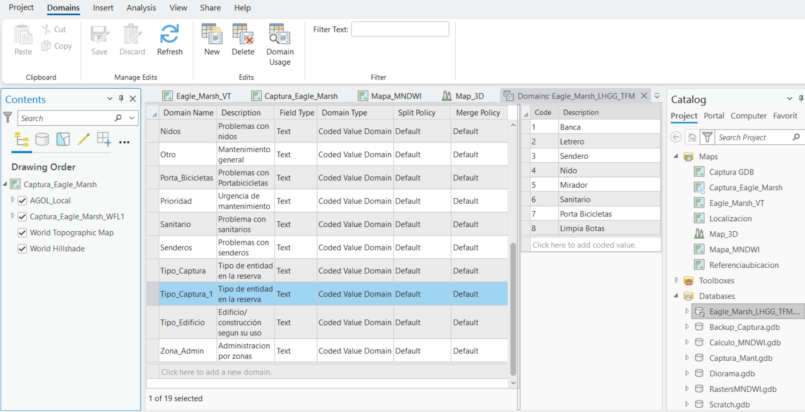
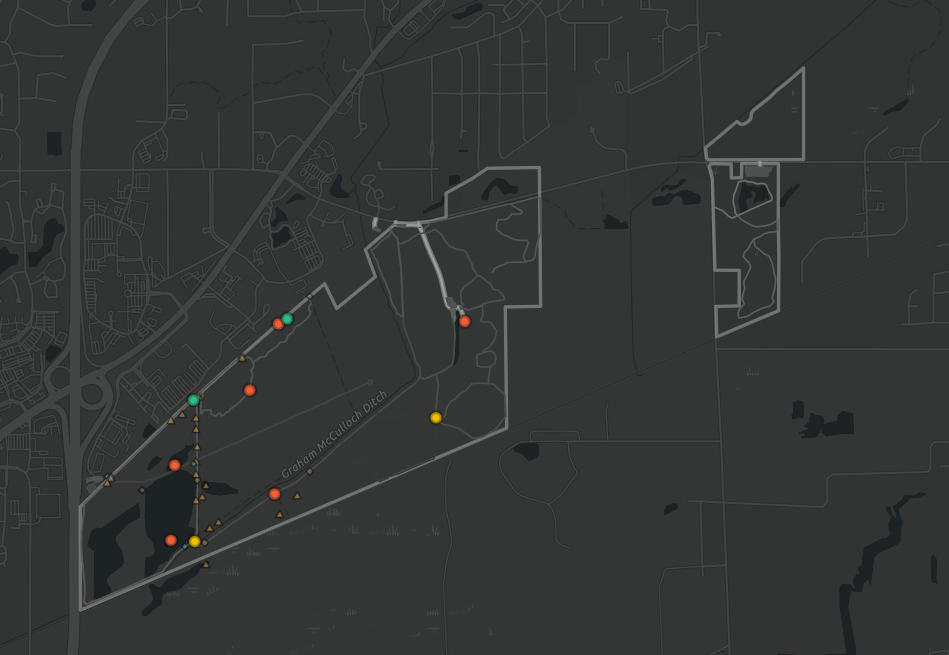
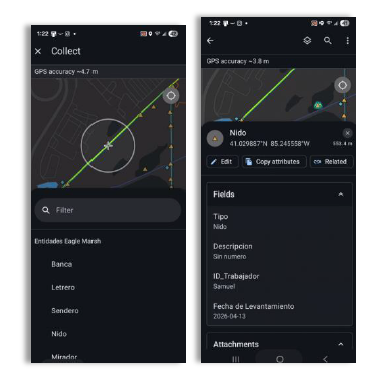

# GIS Solution Components

The completed framework produces a series of complementary GIS products:

##  🖥️ ArcGIS Pro project

The ArcGIS Pro project serves as the central workspace for data management, spatial analysis, cartographic production, and geoprocessing. It integrates all project datasets, maps, models, and layouts into a single environment that supports the complete analytical workflow.

  

## ⚙️ Automated ModelBuilder workflows

ModelBuilder automates the preprocessing of Sentinel-2 imagery, including clipping, resampling, and raster preparation. These workflows reduce manual processing time, improve consistency, and enable the analysis to be repeated whenever new imagery becomes available.

  

  
## 🛰️ Custom raster function for temporal moisture comparison

A custom raster function compares moisture conditions between satellite acquisition dates by calculating temporal changes in the Modified Normalized Difference Water Index (MNDWI). This modular approach enables rapid processing without permanently generating intermediate datasets.

  

  
## 🌿 Moisture Gain and Loss Analysis

The temporal comparison identifies areas where surface moisture has increased or decreased between acquisition dates. The resulting maps support the interpretation of seasonal hydrologic dynamics and provide the basis for subsequent spatial analyses.

  

## ⛰️ Terrain and Slope Analysis

Digital Elevation Model (DEM) data was used to derive terrain characteristics and slope gradients, providing additional context for interpreting water accumulation patterns and understanding the hydrologic behavior of the wetland.

  

  
## 🗃️ Enterprise Geodatabase

The geodatabase was designed to manage park assets using standardized domains, subtypes, and relationship classes. This structure improves data integrity while supporting maintenance history, inspections, and long-term asset management.

  

## 📊 ArcGIS Dashboard

The dashboard consolidates maintenance activities, asset conditions, and operational metrics into a single interface. Interactive maps, indicators, charts, and filters allow managers to quickly identify priorities and monitor ongoing work.

  

## 🌐 ArcGIS StoryMap

The StoryMap communicates the ecological importance of Eagle Marsh through interactive maps, imagery, and narrative content. It was designed for a general audience, translating technical analyses into an accessible and engaging experience.

  

## 👷 Workforce Project

ArcGIS Workforce coordinates maintenance assignments by linking field personnel with specific tasks and park assets. The application supports real-time task tracking and improves communication between managers and field crews.

  

## 📱 Field Maps

Field Maps provides a standardized workflow for collecting infrastructure inventory and inspection data directly from mobile devices. The application improves data quality while reducing the need for manual transcription and post-processing.

  

## 📚 Technical Documentation

The repository includes detailed technical documentation describing the analytical framework, data preparation, geoprocessing models, and system architecture. Together, these documents enable the workflow to be understood, reproduced, and extended by other GIS professionals.
